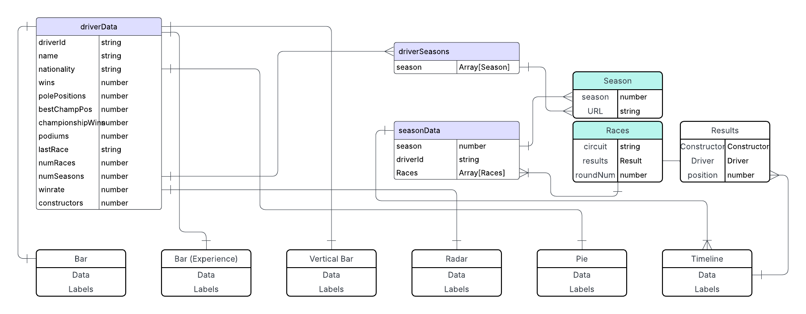
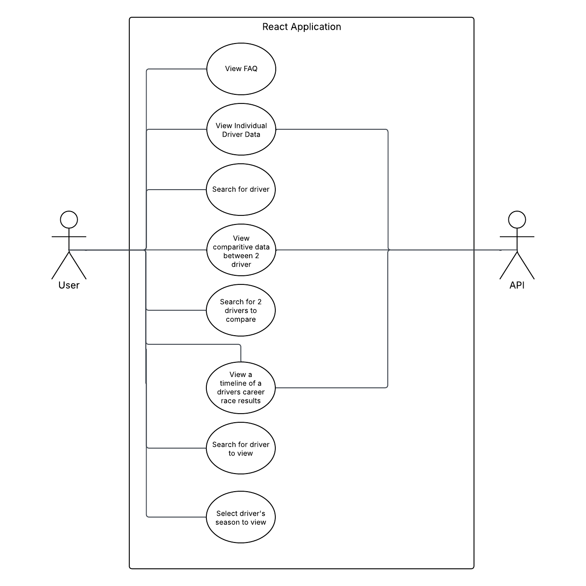

# Technical Overview

## Application Summary

Turn1Data is a react-based web application that allows for users to view statistics of f1 drivers from all across the sports history. The application is powered by the Jolpica-F1 API, a free public API that contains information from F1's 75 year long history. Information is displayed to the user through both short text and chart.js charts. The information can be anything from the name of the driver to the number of world drivers championships they have won. Furthermore users can compare the statistics of any two drivers they wish to and can view a certain drivers race results across any of their seasons on a timeline graph.

---

## API Used

The application retrieves its data from the [Jolpica-F1 API](https://github.com/jolpica/jolpica-f1), a free public API for Formula 1 historical data. It supplies detailed records on drivers, constructors, race results, circuits, and standings going back to the 1950s.
  
Data from the API is normalized in the frontend to support visualisation and interaction.

---

## Data Visualisations

The app uses multiple chart types to present driver data in an intuitive and comparative format. Each chart is powered by data from the API.

The charts are retrieved from [Chart.js](https://www.chartjs.org) and include the following:

- Bar Chart
- Radar Chart
- Pie Chart
- Timeline Graph

These charts are dynamically updated based on the driver selection and season data range.

---

## Data Models

The following diagrams illustrate how data is structured in the application. These can be accessed in the `Documentation` folder:

---

## Known Limitations

- **Historical Consistency**: The API does not include information for qualifying positions prior to the 1994 season. As such, the pole positions for drivers that raced prior to that may be inaccurate

- **API Speed**: At the time of development, the API limits data set retrieval to 4 calls per second. Furthermore, some data presented is not directly accessible and requires multiple calls to retrieve. This results in a somewhat lengthy loading screen while information is retrieved.

- **Constructors**: There is no option to view information from constructors, users may only view driver information.
